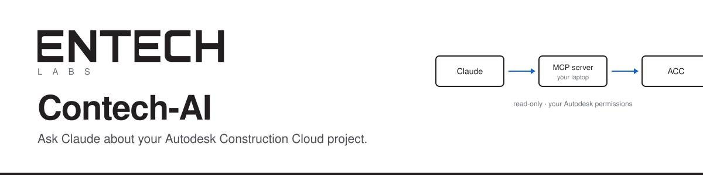

<p align="center">
  
</p>

<p align="center">
  <a href="LICENSE"></a>
  
  
  
  
</p>

# Contech-AI — Autodesk Connector for Claude

Ask Claude questions about your **Autodesk Construction Cloud (ACC)** project in plain English —
*"Which submittals are overdue?"*, *"Who has the most open issues?"* — and get answers,
tables, and dashboards built from your live project data.

```
Claude Desktop  ──►  acc_mcp.py (on your laptop)  ──►  Autodesk ACC
  you ask              reads your project data          RFIs, issues, submittals,
                       with your Autodesk login          cost, members, documents
```

- **Read-only.** It can look at ACC data; it cannot create, change, or delete anything.
- **Runs on your own Windows laptop.** Your credentials stay in a file on your machine.
- **You see only what your Autodesk login can see** in ACC.

Setup takes about 30 minutes the first time. You need:

| | |
|---|---|
| Windows 10 or 11 | with PowerShell (built in) |
| [Claude Desktop](https://claude.ai/download) | installed and signed in |
| [Python 3.10+](https://www.python.org/downloads/) | tick **"Add python.exe to PATH"** when installing |
| An ACC project | that your Autodesk account can open |
| An ACC Account Admin | to approve the app once (step 2) — may be you |

---

## Step 1 — Create an APS app

APS (Autodesk Platform Services) is how programs are allowed to talk to Autodesk. The app is
the "doorway"; your Autodesk login decides what's behind it.

1. Go to **[aps.autodesk.com/myapps](https://aps.autodesk.com/myapps)** and sign in.
2. **Create application**:
   - **Application type:** Traditional Web App
   - **APIs:** tick **Data Management API** and **Autodesk Construction Cloud API**
   - **Callback URL:** `http://localhost:5002/callback` — exactly this
3. Copy the **Client ID** and **Client Secret**. Treat the secret like a password.

**What's the callback URL?** When you sign in to Autodesk, the browser is sent back to this
address with a one-time code. The connector listens on port 5002 on your own laptop, catches the
code, and swaps it for your sign-in. It's only used during that one-time sign-in.

## Step 2 — Approve the app in ACC (Custom Integrations)

An **ACC Account Admin** adds your app to the account that holds your project:

**ACC → Account Admin → Custom Integrations → Add** → paste your **Client ID**.

Without this, every request returns **403 (access denied)** — and the error doesn't say why.

## Step 3 — Find your project ID

Open your project at [acc.autodesk.com](https://acc.autodesk.com) and look at the address bar:

```
https://acc.autodesk.com/docs/files/projects/1a2b3c4d-1111-2222-3333-444455556666?folderUrn=...
                                             └──────────── project ID ────────────┘
```

Put **`b.`** in front: `b.1a2b3c4d-1111-2222-3333-444455556666`.

## Step 4 — Get the code

**From the download link you were given (no Git needed):**

1. Download **`Contech-AI.zip`** from the link.
2. Right-click it → **Extract All…** → change the destination to `C:\Users\<you>` → **Extract**.
   You get the folder `C:\Users\<you>\Contech-AI`.
3. If Windows says the files came from the internet, run this once in PowerShell to unblock them:
   ```powershell
   Get-ChildItem C:\Users\$env:USERNAME\Contech-AI -Recurse | Unblock-File
   ```

The setup script works from wherever the folder is, so any location is fine.

**From GitHub:** click **Code → Download ZIP** on this page (it unzips as `Contech-AI-main`), or:

```powershell
cd $HOME
git clone https://github.com/entech-labs/Contech-AI.git
cd Contech-AI
```

## Step 5 — Install (one command)

Open **PowerShell** in the Contech-AI folder and run:

```powershell
powershell -ExecutionPolicy Bypass -File .\setup.ps1
```

It checks Python, creates a private environment (`.venv`), installs the libraries, creates your
`.env` settings file and opens it in Notepad, checks port 5002, and prints the exact Claude
config block for your folder.

<details>
<summary>Prefer to do it by hand?</summary>

```powershell
python -m venv .venv
.\.venv\Scripts\pip install -r requirements.txt
copy .env.example .env
notepad .env
```

</details>

**The libraries it installs:**

| Library | What it does |
|---|---|
| `httpx` | Talks to Autodesk's web APIs |
| `python-dotenv` | Reads your settings from `.env` |
| `fastmcp` + `mcp` | Speak MCP — the protocol Claude Desktop uses to call tools |

## Step 6 — Fill in `.env`

In Notepad, replace the three `<...>` values and save:

```
APS_CLIENT_ID=<client ID from step 1>
APS_CLIENT_SECRET=<client secret from step 1>
APS_CALLBACK_URL=http://localhost:5002/callback
DEFAULT_PROJECT_ID=b.<project ID from step 3>
```

Make sure it's saved as **`.env`**, not `.env.txt` (in File Explorer: View → Show →
**File name extensions**).

## Step 7 — Sign in to Autodesk (once)

```powershell
.\.venv\Scripts\python acc_mcp.py --test
```

Your browser opens → sign in with your Autodesk account → click **Allow**. You should see:

```
Signed in. Sign-in saved to ...\Contech-AI\.mcp_token.json
Checking project b.1a2b3c4d-... ...
  RFIs        12
  issues      8
  submittals  40

SUCCESS: Claude will be able to read this project.
```

The sign-in is saved in `.mcp_token.json` and renews itself — no browser needed again, as long as
you use it at least every couple of weeks. **Never copy or share that file.**

## Step 8 — Connect Claude Desktop

1. **Quit Claude completely.** Closing the window isn't enough — Claude keeps running in the
   background and will overwrite your change when it exits:
   ```powershell
   Stop-Process -Name claude -Force
   ```
2. **Open Claude's config file:**
   ```powershell
   notepad "$env:APPDATA\Claude\claude_desktop_config.json"
   ```
3. **Add the block** `setup.ps1` printed inside `"mcpServers"` (template in
   [`claude/claude_desktop_config.example.json`](claude/claude_desktop_config.example.json)):
   ```json
   "autodesk-connector": {
     "command": "C:\\Users\\<you>\\Contech-AI\\.venv\\Scripts\\python.exe",
     "args": ["C:\\Users\\<you>\\Contech-AI\\acc_mcp.py"]
   }
   ```
   - File empty? Wrap it: `{ "mcpServers": { ...block... } }`
   - File has other settings? Add `"mcpServers": { ...block... },` right after the first `{`.
   - Keep the **double backslashes** and the **commas** between entries.
4. **Save**, start Claude Desktop → your name (bottom-left) → **Settings → Developer** →
   `autodesk-connector` should say **running**.
5. In a chat, open the **tools menu** (sliders / "+" icon) and make sure **autodesk-connector** is on.

Claude starts the connector itself whenever it opens — there's nothing to keep running.

## Step 9 — Create a Claude Project

**Projects → New project** → name it (e.g. "ACC Project") → **project instructions** → paste the
text from [`claude/project_instructions.md`](claude/project_instructions.md) with your project ID.

Start a new chat inside the project and try:

- *"Which submittals are overdue?"*
- *"Group submittals by spec section."*
- *"List open issues and who they're assigned to — who has the most?"*
- *"Export all RFIs to CSV."* (saved in `exports\`)

Click **Allow** when Claude asks to use a tool.

## Step 10 (optional) — Dashboard Skill

[`skills/acc-dashboard/SKILL.md`](skills/acc-dashboard/SKILL.md) teaches Claude to build the same
project overview dashboard every time — KPIs, submittals by status and spec section, open items by
person, and an overdue list — from **live** data.

1. Zip the `skills\acc-dashboard` folder (right-click → **Send to → Compressed (zipped) folder**).
2. In Claude, go to **Settings → Capabilities → Skills** and upload the zip. (Menu names can
   vary by Claude version and plan; custom Skills may need to be enabled by your admin.)
3. Ask: *"Build the project dashboard."* Later: *"Refresh the dashboard."*

Dashboards are snapshots — "refresh" pulls fresh data and rebuilds in about a minute.

---

## What Claude can read

| Tool | Returns |
|---|---|
| `list_rfis` | RFIs |
| `list_issues` | Issues |
| `list_submittals` | Submittal items |
| `list_budgets` | Cost budget lines |
| `list_contracts` | Contracts / purchase orders |
| `list_change_orders` | Change orders (`pco`, `rfq`, `rco`, `oco`, `sco`) |
| `list_project_users` | Project members (turns IDs into names) |
| `browse_folder` | Docs folders and files (give it a folder ID) |
| `list_hubs` / `list_projects` | Accounts / projects (may be blocked for some logins) |

All read-only. Up to 200 rows come back into the chat; ask for a CSV for everything.

## Troubleshooting

| Problem | Fix |
|---|---|
| `SETUP NEEDED` on `--test` | `.env` still has `<...>` values or is saved as `.env.txt` |
| Browser shows a redirect / callback error | The Callback URL in the APS portal doesn't match `.env` exactly (including `/callback`) |
| `Port 5002 is already in use` | Another program holds it: `netstat -ano \| findstr :5002`, close that program, try again |
| Signed in, but `403` / "access denied" | App not added under ACC Custom Integrations (step 2), or your login isn't on the project |
| `list_hubs` says `hub_listing_blocked` | Normal for some accounts — the project tools still work with your project ID |
| Settings → Developer: "No servers added" | Claude overwrote the config — quit it fully, add the block again, save, restart |
| `autodesk-connector` shows **failed** | Click it for the log — usually a wrong path or a missing comma in the config |
| Claude answers about the wrong project | Start a new chat inside your Claude Project |
| `python` opens the Microsoft Store | Settings → Apps → Advanced app settings → App execution aliases → turn off `python.exe` |
| Claude says sign-in is required | Run `.\.venv\Scripts\python acc_mcp.py --test` again |

## Security

- **Read-only by design:** it only asks Autodesk for `data:read` and `account:read`.
- `.env` (your secret) and `.mcp_token.json` (your sign-in) stay on your laptop and are excluded
  from Git by `.gitignore`. Never share them, email them, or commit them.
- Using a test app for a demo? Delete it in the APS portal afterwards and remove it from
  Custom Integrations.
- Everything Claude shows comes from your ACC permissions — it can't see more than you can.

## License

[MIT](LICENSE) — free to use and adapt. Not affiliated with or endorsed by Autodesk or Anthropic.

---

## About

Built by **[EnTech Labs](https://entechnology.io)** — the technology practice of
[EnTech Engineering](https://entech.nyc), the group that builds the software behind our
infrastructure work across the New York metropolitan region.

This repository is the companion to our **Contech AI** training session. It is a teaching
example: a small, readable MCP server you can pull apart, point at your own systems, and learn
from. The same ~500 lines work against any API you already have — ACC is just the one we
needed first.

Questions from the session, or something unclear in the steps above? **[Open an
issue](https://github.com/entech-labs/Contech-AI/issues)** — we would rather fix the
instructions than answer the same question twice.

*Not affiliated with or endorsed by Autodesk or Anthropic.*
